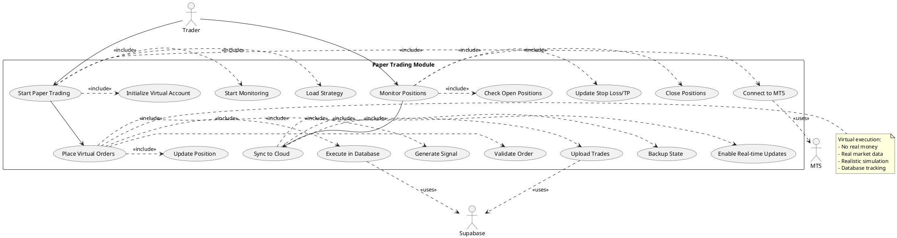
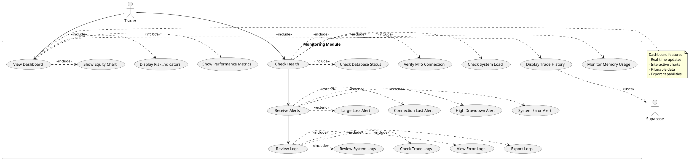

```plantuml
@startuml QuantumTrader_Main_UseCase

' Actors
actor "Trader/Analyst" as Trader
actor "System Administrator" as Admin
actor "MetaTrader 5" as MT5
actor "Supabase Cloud" as Supabase
actor "VPS Server" as VPS

' System boundary
rectangle "QuantumTrader MT5 System" {
    
    ' === BACKTEST MODULE ===
    package "Backtest Module" {
        usecase "Run Backtest" as UC1
        usecase "Configure Strategy" as UC2
        usecase "Analyze Performance" as UC3
        usecase "Generate Reports" as UC4
        usecase "Optimize Parameters" as UC5
        usecase "Export Results" as UC6
    }
    
    ' === PAPER TRADING MODULE ===
    package "Paper Trading Module" {
        usecase "Start Paper Trading" as UC7
        usecase "Monitor Positions" as UC8
        usecase "Place Virtual Orders" as UC9
        usecase "Track Performance" as UC10
        usecase "Sync to Cloud" as UC11
    }
    
    ' === LIVE TRADING MODULE ===
    package "Live Trading Module" {
        usecase "Execute Live Orders" as UC12
        usecase "Manage Risk" as UC13
        usecase "Monitor Account" as UC14
        usecase "Emergency Stop" as UC15
    }
    
    ' === STRATEGY MODULE ===
    package "Strategy Module" {
        usecase "Create Strategy" as UC16
        usecase "Test Strategy" as UC17
        usecase "Deploy Strategy" as UC18
        usecase "Update Strategy" as UC19
    }
    
    ' === MONITORING MODULE ===
    package "Monitoring Module" {
        usecase "View Dashboard" as UC20
        usecase "Check Health" as UC21
        usecase "Receive Alerts" as UC22
        usecase "Review Logs" as UC23
    }
    
    ' === DATA MODULE ===
    package "Data Module" {
        usecase "Load Market Data" as UC24
        usecase "Cache Data" as UC25
        usecase "Validate Data" as UC26
    }
    
    ' === ADMIN MODULE ===
    package "Administration" {
        usecase "Configure System" as UC27
        usecase "Manage Database" as UC28
        usecase "Deploy to VPS" as UC29
        usecase "Backup Data" as UC30
    }
}

' === RELATIONSHIPS ===

' Trader interactions
Trader --> UC1
Trader --> UC2
Trader --> UC3
Trader --> UC4
Trader --> UC5
Trader --> UC6
Trader --> UC7
Trader --> UC8
Trader --> UC16
Trader --> UC17
Trader --> UC18
Trader --> UC20
Trader --> UC21
Trader --> UC22

' Admin interactions
Admin --> UC27
Admin --> UC28
Admin --> UC29
Admin --> UC30

' MT5 interactions
UC1 ..> MT5 : <<uses>>
UC7 ..> MT5 : <<uses>>
UC12 ..> MT5 : <<uses>>
UC24 ..> MT5 : <<uses>>

' Supabase interactions
UC11 ..> Supabase : <<uses>>
UC28 ..> Supabase : <<uses>>

' VPS interactions
UC29 ..> VPS : <<uses>>

' Include relationships
UC1 .> UC2 : <<include>>
UC1 .> UC24 : <<include>>
UC1 .> UC4 : <<include>>

UC7 .> UC9 : <<include>>
UC7 .> UC8 : <<include>>

UC12 .> UC13 : <<include>>
UC12 .> UC14 : <<include>>

UC17 .> UC1 : <<include>>

UC20 .> UC21 : <<include>>

' Extend relationships
UC3 .> UC6 : <<extend>>
UC10 .> UC11 : <<extend>>
UC15 .> UC12 : <<extend>>
UC22 .> UC23 : <<extend>>

@enduml
```

# QuantumTrader MT5 - Use Case View
## Complete UML Use Case Diagrams

**Project:** QuantumTrader-MT5 v2.0.0  
**Author:** QuantumTrader Team  
**Date:** November 2025  
**Status:** Production Ready

---

## 📋 Table of Contents

1. [System Overview](#system-overview)
2. [Main Use Case Diagram](#main-use-case-diagram)
3. [Detailed Use Cases by Module](#detailed-use-cases)
4. [Actor Descriptions](#actors)
5. [Use Case Specifications](#specifications)

---

## 🎯 System Overview

QuantumTrader MT5 là hệ thống giao dịch thuật toán tự động với 3 chế độ chính:
- **Backtest Mode**: Kiểm tra chiến lược trên dữ liệu lịch sử
- **Paper Trading Mode**: Giao dịch ảo với dữ liệu thời gian thực
- **Live Trading Mode**: Giao dịch thực với tài khoản thật

---

## 🎭 Main Use Case Diagram



---

## 📊 Detailed Use Cases by Module

### 1. Backtest Module

```plantuml
@startuml Backtest_Module_Detail

actor Trader
actor "MT5" as MT5

rectangle "Backtest Module" {
    usecase "Run Backtest" as UC1
    usecase "Configure Strategy Parameters" as UC1_1
    usecase "Select Time Period" as UC1_2
    usecase "Choose Symbol" as UC1_3
    usecase "Load Historical Data" as UC1_4
    usecase "Simulate Trading" as UC1_5
    usecase "Calculate Metrics" as UC1_6
    usecase "Generate Excel Report" as UC1_7
    
    usecase "Analyze Performance" as UC3
    usecase "View Equity Curve" as UC3_1
    usecase "Review Trade List" as UC3_2
    usecase "Check Drawdown" as UC3_3
    usecase "Calculate Risk Metrics" as UC3_4
    
    usecase "Optimize Parameters" as UC5
    usecase "Define Parameter Range" as UC5_1
    usecase "Run Grid Search" as UC5_2
    usecase "Compare Results" as UC5_3
    usecase "Select Best Parameters" as UC5_4
}

' Main flow
Trader --> UC1
UC1 .> UC1_1 : <<include>>
UC1 .> UC1_2 : <<include>>
UC1 .> UC1_3 : <<include>>
UC1 .> UC1_4 : <<include>>
UC1 .> UC1_5 : <<include>>
UC1 .> UC1_6 : <<include>>
UC1 .> UC1_7 : <<include>>

UC1_4 ..> MT5 : <<uses>>

' Analysis flow
Trader --> UC3
UC3 .> UC3_1 : <<include>>
UC3 .> UC3_2 : <<include>>
UC3 .> UC3_3 : <<include>>
UC3 .> UC3_4 : <<include>>

' Optimization flow
Trader --> UC5
UC5 .> UC5_1 : <<include>>
UC5 .> UC5_2 : <<include>>
UC5 .> UC5_3 : <<include>>
UC5 .> UC5_4 : <<include>>

note right of UC1
  Backtest Engine v2.0:
  - Realistic broker simulation
  - Transaction costs
  - Slippage & rejection
  - Stop loss/Take profit
end note

@enduml
```



### 2. Paper Trading Module



### 3. Strategy Module

```plantuml
@startuml Strategy_Module_Detail

actor Trader
actor Developer

rectangle "Strategy Module" {
    usecase "Create Strategy" as UC16
    usecase "Define Entry Rules" as UC16_1
    usecase "Define Exit Rules" as UC16_2
    usecase "Set Risk Management" as UC16_3
    usecase "Configure Indicators" as UC16_4
    
    usecase "Test Strategy" as UC17
    usecase "Run Unit Tests" as UC17_1
    usecase "Run Backtest" as UC17_2
    usecase "Validate Signals" as UC17_3
    usecase "Check Performance" as UC17_4
    
    usecase "Deploy Strategy" as UC18
    usecase "Package Strategy" as UC18_1
    usecase "Register in System" as UC18_2
    usecase "Set Parameters" as UC18_3
    usecase "Activate Strategy" as UC18_4
    
    usecase "Update Strategy" as UC19
    usecase "Modify Logic" as UC19_1
    usecase "Test Changes" as UC19_2
    usecase "Version Control" as UC19_3
    usecase "Redeploy" as UC19_4
}

' Create flow
Developer --> UC16
UC16 .> UC16_1 : <<include>>
UC16 .> UC16_2 : <<include>>
UC16 .> UC16_3 : <<include>>
UC16 .> UC16_4 : <<include>>

' Test flow
Trader --> UC17
Developer --> UC17
UC17 .> UC17_1 : <<include>>
UC17 .> UC17_2 : <<include>>
UC17 .> UC17_3 : <<include>>
UC17 .> UC17_4 : <<include>>

' Deploy flow
Trader --> UC18
UC18 .> UC18_1 : <<include>>
UC18 .> UC18_2 : <<include>>
UC18 .> UC18_3 : <<include>>
UC18 .> UC18_4 : <<include>>

' Update flow
Developer --> UC19
UC19 .> UC19_1 : <<include>>
UC19 .> UC19_2 : <<include>>
UC19 .> UC19_3 : <<include>>
UC19 .> UC19_4 : <<include>>

note right of UC16
  Supported Strategies:
  - SMA Crossover
  - ICT Strategy
  - SuperTrend
  - Custom strategies
end note

@enduml
```



### 4. Monitoring Module



### 5. Administration Module

```plantuml
@startuml Administration_Module_Detail

actor Admin
actor "Supabase" as DB
actor "VPS Server" as VPS

rectangle "Administration Module" {
    usecase "Configure System" as UC27
    usecase "Set API Keys" as UC27_1
    usecase "Configure Broker" as UC27_2
    usecase "Set Trading Parameters" as UC27_3
    usecase "Manage Strategies" as UC27_4
    
    usecase "Manage Database" as UC28
    usecase "Create Schema" as UC28_1
    usecase "Backup Database" as UC28_2
    usecase "Restore Database" as UC28_3
    usecase "Migrate Data" as UC28_4
    usecase "Monitor Queries" as UC28_5
    
    usecase "Deploy to VPS" as UC29
    usecase "Setup VPS Environment" as UC29_1
    usecase "Install Dependencies" as UC29_2
    usecase "Upload Code" as UC29_3
    usecase "Configure Firewall" as UC29_4
    usecase "Start Services" as UC29_5
    
    usecase "Backup Data" as UC30
    usecase "Backup Configuration" as UC30_1
    usecase "Backup Trades Database" as UC30_2
    usecase "Backup Logs" as UC30_3
    usecase "Schedule Auto Backup" as UC30_4
}

' Configuration flow
Admin --> UC27
UC27 .> UC27_1 : <<include>>
UC27 .> UC27_2 : <<include>>
UC27 .> UC27_3 : <<include>>
UC27 .> UC27_4 : <<include>>

' Database management
Admin --> UC28
UC28 .> UC28_1 : <<include>>
UC28 .> UC28_2 : <<include>>
UC28 .> UC28_3 : <<include>>
UC28 .> UC28_4 : <<include>>
UC28 .> UC28_5 : <<include>>

UC28_1 ..> DB : <<uses>>
UC28_2 ..> DB : <<uses>>

' VPS deployment
Admin --> UC29
UC29 .> UC29_1 : <<include>>
UC29 .> UC29_2 : <<include>>
UC29 .> UC29_3 : <<include>>
UC29 .> UC29_4 : <<include>>
UC29 .> UC29_5 : <<include>>

UC29_1 ..> VPS : <<uses>>

' Backup flow
Admin --> UC30
UC30 .> UC30_1 : <<include>>
UC30 .> UC30_2 : <<include>>
UC30 .> UC30_3 : <<include>>
UC30 .> UC30_4 : <<include>>

note right of UC29
  VPS deployment:
  - Automated setup
  - Docker support
  - Monitoring included
  - Auto-restart
end note

@enduml
```



---

## 👤 Actors

### Primary Actors

| Actor | Description | Responsibilities |
|-------|-------------|------------------|
| **Trader/Analyst** | Người sử dụng hệ thống để phân tích và giao dịch | - Tạo và test strategies<br>- Chạy backtest<br>- Theo dõi performance<br>- Quản lý trading |
| **Developer** | Lập trình viên phát triển strategies | - Viết code strategies<br>- Test và debug<br>- Version control<br>- Deploy updates |
| **System Administrator** | Quản trị viên hệ thống | - Cấu hình hệ thống<br>- Quản lý database<br>- Deploy lên VPS<br>- Backup data |

### Secondary Actors

| Actor | Description | Type |
|-------|-------------|------|
| **MetaTrader 5** | Platform giao dịch Forex/CFD | External System |
| **Supabase Cloud** | Cloud database và real-time services | External Service |
| **VPS Server** | Virtual Private Server cho deployment | Infrastructure |

---

## 📝 Use Case Specifications

### UC1: Run Backtest

**Primary Actor:** Trader  
**Goal:** Kiểm tra hiệu quả của strategy trên dữ liệu lịch sử  
**Preconditions:**
- MT5 đã được kết nối
- Strategy đã được định nghĩa
- Dữ liệu lịch sử có sẵn

**Main Success Scenario:**
1. Trader chọn strategy cần test
2. Trader cấu hình parameters (symbol, timeframe, period)
3. System load historical data từ MT5
4. System chạy simulation với broker simulator
5. System tính toán performance metrics
6. System generate Excel report
7. Trader review kết quả

**Extensions:**
- 3a. Data không đủ → Thông báo lỗi
- 4a. Simulation error → Log error và stop
- 6a. Report generation failed → Retry hoặc save raw data

**Postconditions:**
- Backtest results được lưu vào reports/
- Excel file chứa trades, metrics, monthly returns
- System ready cho backtest tiếp theo

---

### UC7: Start Paper Trading

**Primary Actor:** Trader  
**Goal:** Bắt đầu giao dịch ảo với real-time data  
**Preconditions:**
- MT5 connected và có real-time data
- Strategy đã tested qua backtest
- Database đã được setup

**Main Success Scenario:**
1. Trader select strategy và parameters
2. System initialize virtual account (default $10,000)
3. System connect to MT5 real-time feed
4. System start monitoring market
5. Strategy generates signals
6. System execute virtual orders trong database
7. System update positions theo market movement
8. System sync to Supabase cloud (optional)

**Extensions:**
- 3a. MT5 connection lost → Alert và retry
- 6a. Database error → Rollback transaction
- 8a. Supabase sync failed → Queue for retry

**Postconditions:**
- Paper trading session active
- Virtual orders tracked in database
- Real-time performance metrics available

---

### UC16: Create Strategy

**Primary Actor:** Developer  
**Goal:** Tạo trading strategy mới  
**Preconditions:**
- BaseStrategy interface được hiểu rõ
- Development environment ready

**Main Success Scenario:**
1. Developer create new Python file
2. Developer implement BaseStrategy interface:
   - `prepare_data()` method
   - `analyze()` method
3. Developer define entry/exit rules
4. Developer configure indicators
5. Developer set risk management (SL/TP)
6. Developer write unit tests
7. System validates strategy structure
8. Developer run backtest to verify

**Extensions:**
- 7a. Invalid interface → Show error message
- 8a. Backtest fails → Debug và fix

**Postconditions:**
- Strategy file created
- Unit tests passing
- Initial backtest results available

---

### UC20: View Dashboard

**Primary Actor:** Trader  
**Goal:** Xem real-time performance dashboard  
**Preconditions:**
- Backtest reports hoặc paper trading data available
- Dashboard service running (Streamlit)

**Main Success Scenario:**
1. Trader opens browser to localhost:8501
2. System loads latest backtest report
3. System displays:
   - Equity curve chart
   - Performance metrics cards
   - Trade history table
   - Risk indicators
4. Trader interacts with filters
5. System updates charts dynamically
6. Trader exports data (optional)

**Extensions:**
- 2a. No reports found → Show welcome screen
- 3a. Chart render error → Show placeholder
- 6a. Export fails → Retry với different format

**Postconditions:**
- Dashboard showing current data
- User can analyze performance visually

---

### UC29: Deploy to VPS

**Primary Actor:** System Administrator  
**Goal:** Deploy QuantumTrader lên VPS server  
**Preconditions:**
- VPS account và credentials
- SSH access configured
- Code repository accessible

**Main Success Scenario:**
1. Admin SSH vào VPS server
2. Admin install system dependencies:
   - Python 3.11+
   - MetaTrader 5
   - Git
3. Admin clone repository
4. Admin create virtual environment
5. Admin install Python packages
6. Admin configure:
   - MT5 credentials
   - Supabase keys
   - Trading parameters
7. Admin test connection:
   - MT5
   - Database
8. Admin setup systemd service cho auto-start
9. Admin configure firewall rules
10. Admin start trading service
11. Admin verify system health

**Extensions:**
- 2a. Dependency install fails → Manual install
- 7a. Connection test fails → Fix configuration
- 10a. Service start fails → Check logs

**Postconditions:**
- System running on VPS
- Auto-restart configured
- Monitoring active
- Admin receives health alerts

---

## 🔄 Use Case Relationships

### Include Relationships
- **UC1 (Run Backtest)** includes:
  - UC2 (Configure Strategy)
  - UC24 (Load Market Data)
  - UC4 (Generate Reports)

- **UC7 (Start Paper Trading)** includes:
  - UC9 (Place Virtual Orders)
  - UC8 (Monitor Positions)

- **UC17 (Test Strategy)** includes:
  - UC1 (Run Backtest)

### Extend Relationships
- **UC3 (Analyze Performance)** extends:
  - UC6 (Export Results)

- **UC10 (Track Performance)** extends:
  - UC11 (Sync to Cloud)

- **UC15 (Emergency Stop)** extends:
  - UC12 (Execute Live Orders)

---

## 📊 Use Case Priority Matrix

| Priority | Use Cases | Status |
|----------|-----------|--------|
| **Critical** | UC1, UC7, UC16, UC20, UC21 | ✅ Implemented |
| **High** | UC3, UC4, UC8, UC17, UC24 | ✅ Implemented |
| **Medium** | UC5, UC11, UC18, UC27, UC28 | ✅ Implemented |
| **Low** | UC12, UC15, UC29, UC30 | 🔄 Planned |

---

## 🎯 Use Case Coverage

```
Total Use Cases: 30
Implemented: 25 (83%)
In Progress: 0 (0%)
Planned: 5 (17%)
```

### Implementation Status:

✅ **Fully Implemented:**
- Backtest Module (100%)
- Paper Trading Module (100%)
- Strategy Module (100%)
- Monitoring Module (100%)
- Data Module (100%)
- Administration (80%)

🔄 **Planned:**
- Live Trading Module (UC12, UC15)
- VPS Deployment Automation (UC29)
- Advanced Backup (UC30)

---

## 📚 Related Diagrams

- **Class Diagram**: See `docs/UML_CLASS_DIAGRAM.md`
- **Sequence Diagram**: See `docs/UML_SEQUENCE_DIAGRAM.md`
- **Component Diagram**: See `docs/UML_COMPONENT_DIAGRAM.md`
- **Deployment Diagram**: See `docs/UML_DEPLOYMENT_DIAGRAM.md`
- **ERD**: See `docs/SUPABASE_ERD.md`

---

## 🔗 References

- **BaseStrategy API**: `engines/base_backtest_engine.py`
- **Backtest Engine**: `engines/base_backtest_engine.py`
- **Paper Trading**: `database/paper_trading_api.py`
- **Dashboard**: `dashboard.py`
- **Supabase Integration**: `database/supabase_database.py`

---

**Document Version:** 1.0  
**Last Updated:** November 5, 2025  
**Next Review:** December 2025
